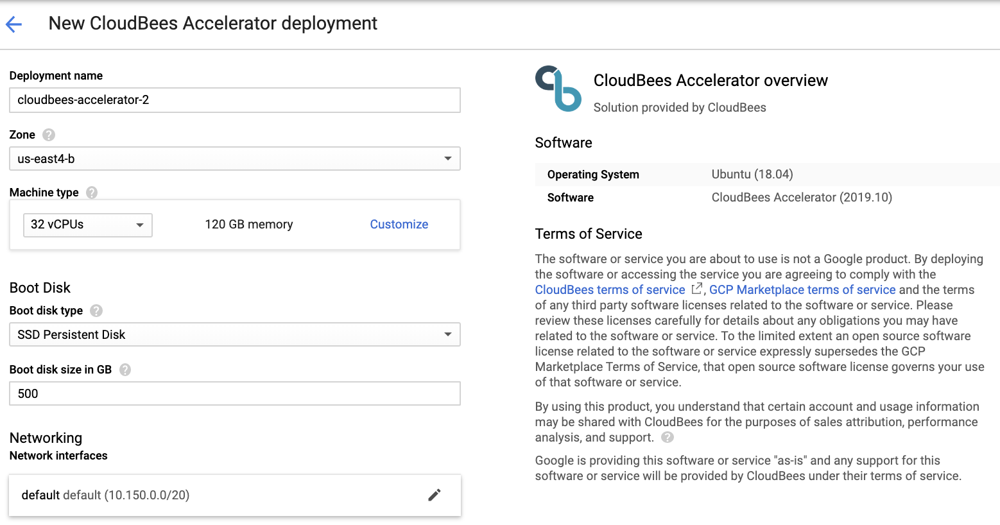
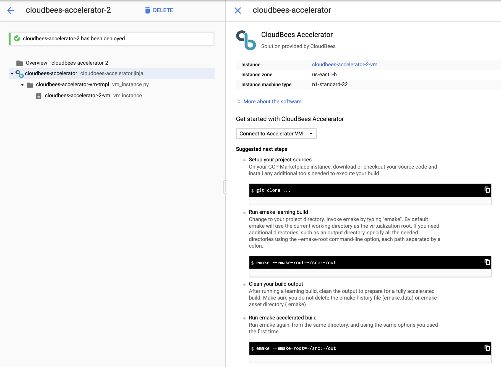

# Getting Started with CloudBees Accelerator On GCP Marketplace


## Deploy CloudBees Accelerator from GCP Marketplace

1. Launch CloudBees Accelerator on Compute Engine.

Visit the CloudBees Accelerator marketplace listing and click on the _LAUNCH ON COMPUTE ENGINE_ button.


2. Choose your deployment parameters.

Choose your parameters for deploying CloudBees Accelerator. Specify your deployment name, zone and machine parameters. The recommended machine for the best performance is a n1-standard-32 (32 vCPUs, 120GB RAM) & 500 GB Persistent SSD.



3. Deploy CloudBees Accelerator.

Click on the _Deploy_ button and wait for the deployment to complete. This will take a few minutes.


4. Proceed to the next section when the deployment is complete.



## Run Your First CloudBees Accelerator Build

1. Connect to your Accelerator VM.

Use the _Connect to Accelerator VM_ button to get a Cloud Shell terminal to your VM.


2. Set up your project resources.

On your GCP Marketplace instance, download or checkout your source code and install any additional tools needed to execute your build.

```
git clone ...
```

3. Run emake learning build.

Change to your project directory. Invoke emake by typing "emake". By default emake will use the current working directory as the virtualization root. If you need additional directories, such as an output directory, specify all the needed directories using the --emake-root command-line option, each path separated by a colon.

```
emake --emake-root=~/src:~/out
```

4. Clean your build output.

After running a learning build, clean the output to prepare for a fully accelerated build. Make sure you do not delete the emake history file (emake.data) or emake asset directory (.emake).

5. Run emake accelerated build.

Run emake again, from the same directory, and using the same options you used the first time.

```
emake --emake-root=~/src:~/out
```

## Additional References

[Release Notes](http://docs.electric-cloud.com/accelerator_doc/QuickStart/HTML/AcceleratorQuickStart.htm#AcceleratorQuickStartDownloadTrial.htm%3FTocPath%3D_____2)

[Electric Make User Guide](http://docs.electric-cloud.com/accelerator_doc/Preview/ReleaseNotes/HTML/AcceleratorReleaseNotes_Preview.htm)

[Cluster Manager Help](http://docs.electric-cloud.com/accelerator_doc/Preview/Help/HTML/AcceleratorHelp_Preview.htm)

[CloudBees Documentation Site](https://docs.cloudbees.com/)

[CloudBees Support Site](https://support.cloudbees.com)